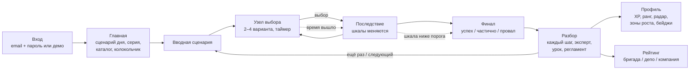
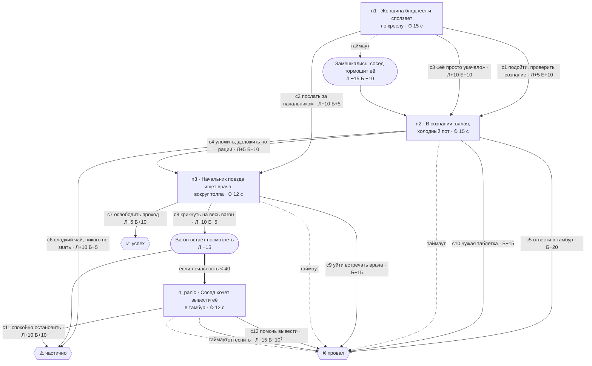
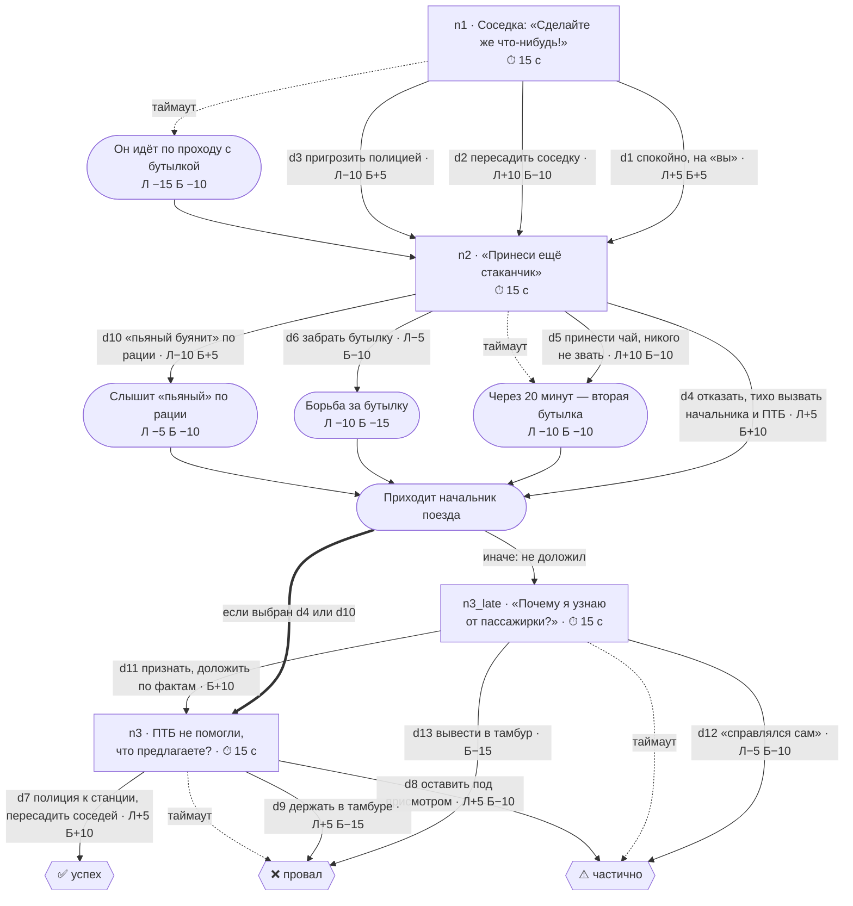

# Проводник 400

«Проводник 400» — тренажёр с элементами геймификации для проводников ВСМ: короткие (3–7 минут)
сценарии нештатных ситуаций с ветвящимися диалогами, выбором на время и двумя шкалами —
лояльностью пассажира и рейтингом безопасности. После каждого сценария — разбор с эталонным
путём, а очки, компетенции, достижения и рейтинг среди коллег складываются в профиль сотрудника.

## Попробовать

```
https://mt-hackathon.nobokik.dev/login?invite=<код-приглашения>
```

`<код-приглашения>` — заглушка, действующий код будет передан вместе с заявкой. Кнопка
«Демо-вход» на этой странице входит под учётной записью демо-проводника. Аналитика бригад ему,
как любому проводнику, закрыта: её видят начальники поездов и методисты (см. «Ограничения»).

## Запустить локально

Нужен только Docker с Compose v2.

```bash
git clone https://github.com/NoboKik/mt-hackathon-submission.git
cd mt-hackathon-submission
cp infra/.env.example infra/.env
docker compose -f infra/docker-compose.yml up --build
```

Затем откройте `http://localhost`.

- При каждом запуске сервис `migrate` применяет миграции и обновляет сценарии из
  `content/scenarios`; демо-данные он добавляет только в пустую базу.
- С пустым `DEMO_INVITE` демо-вход открыт без кода.

Все переменные окружения с пояснениями — в `infra/.env.example`. Главные:

- `POSTGRES_PASSWORD`, `SITE_ADDRESS` — обязательны на сервере, без них `infra/deploy.sh` не
  запустится;
- `AUTH_SECRET` — можно не задавать: ключ подписи сессий генерируется при первом запуске и
  хранится в томе `secrets`;
- `SEED_DEMO` — `1`: при первом запуске добавить демо-проводника и 35 коллег (четыре бригады) для рейтинга;
  `0`: чистая установка без демо-данных;
- `DEMO_INVITE` — код приглашения для демо-входа (пусто — вход открыт);
- `LLM_DAILY_LIMIT` — лимит генераций сценариев в автоматическом режиме за 24 часа
  (по умолчанию 100, `0` — генерация выключена).
- `INTEGRATION_TOKEN` — Bearer-токен выгрузки для HR/LMS (`docs/API.md`); пусто — маршрут
  выключен.

## Соответствие ТЗ

### Функциональные требования

| № | Требование ТЗ | Как сделано | Где в коде |
| --- | --- | --- | --- |
| 1 | Профиль проводника | XP (сумма лучших результатов по сценариям), ранг Стажёр → Проводник → Старший → Наставник, баллы и уровни пяти компетенций на радаре, история прохождений | `packages/shared/src/profile.ts`, `GET /api/me`, экран `/profile` |
| 2 | Нелинейный движок сценариев | Сценарий — граф в JSON: узлы выбора, последствия, финалы; условные ветки по шкалам и по прошлым выборам (схема v1.1); 2–4 финала в каждом сценарии | `packages/shared/src/engine.ts`, `schema.ts`, `validate.ts`, `content/scenarios/*.json` |
| 3 | Таймеры | 10–20 с на решение; истечение времени — отдельная ветка `onTimeout`, обычно худшая. Время считает сервер: опоздание больше 2 с — таймаут | `app/api/sessions/[id]/choose/route.ts`, `components/player.tsx` |
| 4 | Две шкалы | «Лояльность пассажира» и «Рейтинг безопасности» 0–100, каждое решение двигает их по-разному; падение ниже порога досрочно завершает сценарий провалом. Валидатор требует в каждом сценарии хотя бы один выбор «лояльность против безопасности» | `engine.ts`, `validate.ts`, `components/meters.tsx` |
| 5 | Достижения | 10 бейджей за прохождения и освоение компетенций, уровни по XP и по каждой компетенции | `packages/shared/src/achievements.ts`, `profile.ts` |
| 6 | Таблица лидеров | Бригада / депо / компания, неделя / всё время, фильтр по депо | `app/api/leaderboard/route.ts`, `lib/leaderboard.ts`, экран `/leaderboard` |
| 7 | Разбор решений | По каждому шагу: как изменились шкалы и компетенции, какое последствие наступило, как поступил бы эксперт; урок и пункт регламента | `packages/shared/src/engine.ts` (`debriefSteps`), `GET /api/sessions/:id/debrief`, экран `/debrief/:id` |
| 8 | Уведомления | Колокольчик: новый сценарий, сценарий дня, серия сгорит сегодня в 23:59, недельные очки обнулятся через N дней, новый бейдж | `packages/shared/src/notifications.ts`, `GET /api/notifications` |
| 9 | Аналитика | У игрока — «Зоны роста»: слабая компетенция, доля таймаутов, доля неэкспертных решений по категориям, самая частая ошибка, рекомендованный сценарий. У бригады — средние баллы, слабая компетенция и узлы, где чаще ошибаются | `profile.ts` (`growthZones`), `lib/analytics.ts`, экраны `/profile`, `/admin/analytics` |

### Нефункциональные требования и документация

| Требование | Как сделано |
| --- | --- |
| Модульность, разделение frontend и backend | Страницы работают только через REST API (`lib/client.ts` → `app/api/*`), в базу не ходят. Игровое ядро — отдельный пакет чистых функций `packages/shared`. См. [docs/ARCHITECTURE.md](docs/ARCHITECTURE.md) |
| Горизонтальное масштабирование | Состояние только в Postgres, сессии — подписанная cookie, пул авто-режима под advisory-lock, запись шага оптимистичная. Потолки перечислены в ARCHITECTURE.md |
| Документированный API для HR/LMS | OpenAPI 3.1 [`apps/web/public/openapi.yaml`](apps/web/public/openapi.yaml), Swagger UI на `/api-docs.html`, заведение сотрудников `PUT /api/integration/users/:employeeId` и выгрузка `GET /api/integration/progress` по Bearer-токену, руководство [docs/API.md](docs/API.md). Тест сверяет спецификацию с кодом |
| Расширяемость без переписывания ядра | Новый сценарий — JSON-файл, проверяемый `pnpm validate:content`; граф любого сценария виден на экране методиста `/admin/:id`; бейдж — одно правило в `achievements.ts` |
| README, локальный запуск, Docker | Разделы «Запустить локально» и «Разработка», `infra/docker-compose.yml` |
| Производительность | Сценарий целиком лежит в одной строке Postgres (jsonb); переход — чистая функция в памяти, один запрос на чтение и один на запись за шаг |
| Git, качество кода | Инкрементальная история; CI (GitHub Actions): typecheck, Biome, проверка сценариев, Vitest, сборка |
| 152-ФЗ, синтетические данные | Раздел «Безопасность и 152-ФЗ» |
| Архитектура (диаграммы) | [docs/ARCHITECTURE.md](docs/ARCHITECTURE.md): компоненты и последовательность одного шага |
| User Flow и примеры сценариев | Раздел «Пользовательский сценарий» ниже |

## Пользовательский сценарий



1. Проводник входит и видит сценарий дня, свою серию и каталог по компетенциям.
2. Сценарий — 3–7 минут. На каждом узле 2–4 варианта и таймер 10–20 с; порядок вариантов
   перемешан для каждой сессии. После выбора показывается последствие и движутся шкалы; линия
   порога видна на шкале.
3. Финал зависит от пути: успех, частичный успех или провал. Провал бывает и досрочным — если
   лояльность или безопасность упали ниже порога.
4. Разбор показывает каждый шаг: что изменилось и почему, и что выбрал бы эксперт там, где игрок
   с его пути сошёл. Дальше — урок и ссылка на пункт регламента.
5. Очки, компетенции, бейджи и место в рейтинге обновляются сразу; колокольчик напоминает о
   сценарии дня и о том, что сгорает.

### Пример 1. «Пассажиру плохо в вагоне бизнес-класса» (`medical-faint-01`)

Поезд идёт 380 км/ч, до остановки 40 минут, медиков в составе нет. Старт: лояльность 70,
безопасность 70, порог провала — 20 по обеим шкалам. Л/Б на стрелках — изменение шкал.



- **Компромисс:** «её просто укачало» (c3) и сладкий чай (c6) успокаивают вагон и поднимают
  лояльность, но роняют безопасность; отправить соседа за начальником, не подойдя самому (c2),
  — наоборот.
- **Условие:** громкое объявление (c8) ведёт к панике соседа, только если лояльность к этому
  моменту уже ниже 40; иначе сценарий заканчивается частичным успехом.
- **Эксперт:** c1 → c4 → c7. В разборе — урок о том, почему о плохом самочувствии всегда
  докладывают начальнику поезда, и пункт регламента.

### Пример 2. «Нетрезвый пассажир мешает соседям» (`conflict-drunk-01`)

Бизнес-класс, до остановки около часа, полиции в поезде нет. Старт: лояльность 60,
безопасность 65, пороги — 25 и 30.



- **Компромисс:** чай «по-хорошему» (d5) поднимает лояльность и роняет безопасность; угроза
  полицией при всех (d3) и слово «пьяный» по рации (d10) — наоборот.
- **Условие по прошлому выбору:** если проводник доложил начальнику (d4 или d10), тот приходит
  уже с планом. Если нет — сначала придётся объяснить, почему начальник узнал о конфликте от
  пассажирки.
- **Эксперт:** d1 → d4 → d7.

Все девять сценариев — в `content/scenarios/`, граф любого из них с условиями на рёбрах
открывается на экране методиста `/admin/<id>`.

## Архитектура

```
  Браузер ──HTTPS──► сервер с Docker (облако или контур заказчика)
                       │ наружу открыты только 80 и 443
      ┌────────────────┼──────── Docker Compose ─────────────────┐
      │  caddy ── TLS (Let's Encrypt), обратный прокси           │
      │    │                                                     │
      │  web :3000 ── Next.js: страницы, /api, игровой движок,   │
      │    │          пополнение пула авто-режима                │
      │  postgres ── всё состояние, том `pgdata`                 │
      │  migrate ── однократно: миграции, первичное заполнение   │
      └────┼─────────────────────────────────────────────────────┘
           └── исходящий запрос, только авто-режим ──► LLM
```

- **Браузер** — обращается к домену из `SITE_ADDRESS` только по HTTPS. Стенд разворачивается
  на любом Linux-сервере с Docker: в облаке или внутри сети заказчика.
- **caddy** — единственный сервис с открытыми портами 80/443; сам получает сертификат
  Let's Encrypt для `SITE_ADDRESS` и проксирует запросы в `web`.
- **web** — Next.js: страницы, API (`app/api/*`), игровой движок, подсчёт очков и пополнение пула
  сценариев автоматического режима. Сервер — единственный источник истины для очков и шкал.
- **postgres** — PostgreSQL 16, всё состояние приложения, том `pgdata`; порт открыт только на
  `127.0.0.1`.
- **migrate** — одноразовый сервис: миграции и первичное заполнение базы, только если она пуста.
- **LLM endpoint** — любой OpenAI-совместимый `/chat/completions`; нужен только автоматическому
  режиму, остальное приложение работает без него.

Подробно, с диаграммой компонентов и последовательностью одного шага сценария, —
[docs/ARCHITECTURE.md](docs/ARCHITECTURE.md).

## API

REST API описан в OpenAPI 3.1: [`apps/web/public/openapi.yaml`](apps/web/public/openapi.yaml).
На сервере — интерактивная документация Swagger UI: `/api-docs.html`
(<https://mt-hackathon.nobokik.dev/api-docs.html>). Для HR и LMS есть интеграционный API по
Bearer-токену: заведение сотрудника `PUT /api/integration/users/:employeeId` и выгрузка прогресса
`GET /api/integration/progress`; как его включить и что в нём приходит, описано в
[docs/API.md](docs/API.md).

Почему бэкенд остался в Next.js: обработчики `app/api/*` — обычный REST поверх HTTP (JSON,
стандартные методы и коды ответа). Интерфейс обращается к ним только через `lib/client.ts`, игровая
логика — в отдельном пакете `packages/shared`, а единственный контракт между сторонами —
спецификация OpenAPI. Frontend и backend можно развести по разным контейнерам, не меняя ни строки
игровой логики.

## Развёртывание у заказчика

Тот же `infra/docker-compose.yml` разворачивается внутри сети ВСМ-400. Языковая модель работает
на собственном GPU-сервере заказчика через vLLM или Ollama с открытой моделью и доступна по
внутреннему адресу (`LLM_BASE_URL`): данные не покидают периметр, система полностью работает
без выхода в интернет. Для такой установки `SEED_DEMO=0`: демо-данных нет, учётные записи
сотрудников заводятся командой `pnpm user:add` (см. «Учётные записи») или HR-системой через
`PUT /api/integration/users/:employeeId`. Прогресс сотрудников забирают HR и LMS через
`GET /api/integration/progress` ([docs/API.md](docs/API.md)); в планах —
корпоративный SSO.

## Безопасность и 152-ФЗ

**Персональные данные.**

- В демо-среде только синтетические данные. Демо-проводник и 35 коллег (четыре бригады) для рейтинга
  генерируются скриптом `apps/web/src/db/seed.ts` детерминированно: вымышленные имена, адреса на
  несуществующем домене `provodnik400.ru`, правдоподобные депо и результаты. Пассажиры в сценариях
  вымышлены. Реальных ПДн сотрудников и пассажиров в репозитории, конфигурации и дампах нет.
- О сотруднике хранится минимум: ФИО, должность, депо, бригада, email для входа и хеш пароля.
  Выгрузка для HR/LMS email не содержит.
- Проводник видит свои результаты и общий рейтинг; разбор чужих слабых компетенций и готовности
  к повышению (аналитика бригад) сервер отдаёт только начальникам поездов и методистам.
- В языковую модель не уходит ничего о пользователе: она получает только тему и правила для
  черновика сценария. Для установки у заказчика модель разворачивается внутри периметра
  (vLLM/Ollama), и данные его не покидают.
- Сервер демо-стенда размещён в России; при установке у заказчика данные остаются в его контуре.
- Для установки у заказчика с реальными сотрудниками: `SEED_DEMO=0`, учётные записи заводит
  оператор (`pnpm user:add`) или HR-система через интеграционный API. Правовые основания обработки ПДн (согласие или трудовой договор) и
  модель угроз оформляет оператор ПДн — работодатель.

**Защита приложения.**

- Пароли — scrypt с солью; cookie сессии подписана HMAC-SHA256, `HttpOnly`, `SameSite=Lax`,
  `Secure` в production. Ключ подписи генерируется при первом запуске и хранится в отдельном
  томе.
- Вход: одинаковый ответ на неверный email и неверный пароль (email не перебрать), не больше 5
  попыток в минуту на пару IP + email; демо-вход закрыт кодом приглашения.
- Интеграционный API выключен, пока не задан `INTEGRATION_TOKEN`; токен сравнивается за
  постоянное время.
- Секреты — только в `.env` (в `.gitignore`), ключ LLM не попадает в браузер. История git
  проверена на ключи и пароли.
- Наружу открыт только Caddy (80/443, HTTPS с сертификатом Let's Encrypt); Postgres слушает
  только `127.0.0.1`.

**Предсказуемое поведение при ошибках.** Каждый маршрут проверяет вход схемой Zod и отвечает
`{ "error": "<код>" }`: 400 — неверный запрос, 401 — нет входа, 404 — чужая или несуществующая
сессия, 409 — устаревший или повторный шаг (двойной клик, вторая вкладка). Очки, шкалы, таймер и
достижения считает только сервер, поэтому подделать результат запросом нельзя.

## Ограничения

- **Контент.** Девять сценариев написаны командой по стандартам обслуживания ВСМ и публичным
  правилам перевозок; перед реальным обучением их должен проверить методист заказчика.
  Сценарии авто-режима — непроверенные черновики модели: они помечены «ИИ-черновик» и не идут в
  рейтинг и аналитику бригад.
- **Роли.** Полной ролевой модели нет. Аналитику бригад (компетенции и готовность коллег) видят
  только сотрудники с должностью «Начальник поезда» или «Методист», и сразу по всей компании, без
  ограничения своей бригадой; остальным сервер отвечает 403. Граф сценария открыт любому
  вошедшему: это учебный контент без персональных данных.
- **Вход.** Email и пароль; учётные записи заводит оператор из командной строки или HR-система
  через интеграционный API; корпоративного SSO и саморегистрации нет.
- **Масштабирование.** Счётчик попыток входа и 30-секундный кэш рейтинга живут в памяти
  процесса: при нескольких контейнерах лимит входа умножается на их число, а рейтинг может
  отставать до 30 с.
- **Таймер.** На сетевую задержку даётся 2 с: на очень медленном соединении честный игрок может
  потерять бонус за скорость.
- **Интеграция.** Два маршрута — заведение сотрудника (`PUT /api/integration/users/:employeeId`)
  и выгрузка прогресса по запросу (`GET /api/integration/progress`) — работают по одному общему
  токену для всех внешних систем; вебхуков и xAPI для LMS и выгрузки для биллинга нет.
- **Интерфейс.** Только веб (вёрстка от 375 px), без офлайн-режима; только русский язык.

## План развития

1. **Пилот** — одно депо или одна группа бригад, 4 недели. Метрики: доля завершённых сценариев,
   рост баллов по компетенциям, доля таймаутов и неэкспертных решений, а с перевозчиком — оценки
   пассажиров до и после.
2. **Роли и редактор сценариев.** Роли «проводник / наставник / методист», редактор графа
   сценария поверх существующего просмотрщика с проверкой тем же валидатором, публикация
   черновиков авто-режима после ревью методиста.
3. **Корпоративная интеграция.** SSO (OIDC/SAML/LDAP), вебхуки и формат xAPI для LMS, токены
   на каждую систему-потребителя, выгрузка для биллинга.
4. **Новые механики.** Свободный ответ пассажиру с оценкой моделью по рубрике, «хардкор»-режим
   сценария дня, множители XP за серию, командные челленджи бригад.
5. **Контент.** Сценарии по оставшимся ситуационным карточкам заказчика, фотографии и схемы
   вагонов разных классов.
6. **Инфраструктура.** Общий кэш и счётчики в Postgres или Redis для нескольких
   веб-контейнеров, модель на GPU-сервере заказчика, PWA с офлайн-прохождением.

## Что сделано до хакатона

Подготовка до выдачи задания разрешена п. 7.6 Положения и раскрывается здесь; даты всех
изменений видны в истории git.

**До 25 сентября 2026** (до получения ТЗ):

- схема сценария v1 и валидатор графа, игровой движок, подсчёт очков;
- база данных, API, вход, демо-вход по приглашению;
- профиль, таблица лидеров, 10 достижений, экран графа сценария;
- интерфейс: каталог, плеер, разбор, профиль, рейтинг; светлая и тёмная темы;
- восемь сценариев, генератор черновиков через LLM и авто-режим;
- Docker Compose, Caddy, развёртывание на сервере, бэкапы.

**25–27 сентября** (в рамках хакатона, по ТЗ):

- разбор каждого решения: изменение шкал, последствие, выбор эксперта; линия порога на шкалах;
- проверка сценариев по стандартам обслуживания ВСМ и ситуационным карточкам из датасета;
- схема v1.1: условные ветки по шкалам и прошлым выборам;
- рейтинг по бригадам, депо и компании;
- сценарий дня, серия, уведомления о новых сценариях и сгорающих баллах;
- «Зоны роста» в профиле и аналитика бригад;
- ограничение попыток входа, единый формат ошибок, advisory-lock для пула авто-режима;
- интеграционный API для HR/LMS, спецификация OpenAPI и Swagger UI, документация
  архитектуры и этот README.

## Технологии, модели и лицензии

Версии и лицензии взяты из `pnpm licenses list` и `package.json`.

| Компонент | Версия | Лицензия | Для чего |
| --- | --- | --- | --- |
| Next.js | 15.5.25 | MIT | Веб-приложение и API |
| React, React DOM | 19.3.0 | MIT | Интерфейс |
| TypeScript | 5.9.3 | Apache-2.0 | Язык |
| Drizzle ORM / drizzle-kit | 0.45.2 / 0.31.10 | Apache-2.0 / MIT | Доступ к базе, миграции |
| postgres (postgres.js) | 3.4.9 | Unlicense | Драйвер PostgreSQL |
| Zod | 4.6.5 | MIT | Схема сценария, проверка запросов |
| TanStack Query | 5.103.1 | MIT | Запросы к API на клиенте |
| Zustand | 5.0.15 | MIT | Состояние плеера |
| Recharts | 3.10.1 | MIT | Радар компетенций, графики аналитики |
| Framer Motion | 13.4.0 | MIT | Анимации |
| lucide-react | 1.47.0 | ISC | Иконки |
| Tailwind CSS, @tailwindcss/postcss | 4.3.3 | MIT | Стили |
| tailwind-merge, clsx, tw-animate-css | 3.7.0, 2.1.1, 1.4.0 | MIT | Стили |
| class-variance-authority | 0.7.1 | Apache-2.0 | Варианты компонентов |
| Biome | 2.5.14 | MIT OR Apache-2.0 | Линтер и форматтер |
| Vitest | 5.0.1 | MIT | Тесты |
| tsx, dotenv | 4.23.13, 17.4.2 | MIT, BSD-2-Clause | Скрипты seed и user:add |
| PostgreSQL | 16 (образ `postgres:16-alpine`) | PostgreSQL License | База данных |
| Caddy | 2 (образ `caddy:2-alpine`) | Apache-2.0 | HTTPS, reverse proxy |
| Node.js | ≥ 22 | MIT | Среда выполнения |
| Swagger UI (swagger-ui-dist, CDN jsdelivr) | 5.33.0 | Apache-2.0 | Страница `/api-docs.html` |
| Шрифт Moscow Sans (файлы в `apps/web/src/app/fonts/`) | — | Предоставлен организаторами хакатона для использования в проекте | Типографика |

Среди транзитивных зависимостей есть `sharp-libvips` (LGPL-3.0-or-later, подключается
динамически для оптимизации изображений в Next.js), `caniuse-lite` (CC-BY-4.0) и `lightningcss`
(MPL-2.0, только при сборке). Их лицензии допускают такое использование.

**Модель.** Авто-режим обращается к любому OpenAI-совместимому `/chat/completions`
(`LLM_BASE_URL`, `LLM_MODEL`). На стенде — **DeepSeek V4.1 Flash** (`deepseek-v4.1-flash`),
открытые веса, лицензия MIT
([карточка модели](https://huggingface.co/deepseek-ai/DeepSeek-V4.1-Flash)); её можно запустить
у заказчика через vLLM или Ollama. Без модели приложение работает полностью, кроме авто-режима.

**Данные.** Сценарии — оригинальный текст команды. Пункты регламентов в разборах указаны номером
и пересказаны своими словами; список источников — `content/regulations.json`. Датасет
организатора в репозиторий не входит. Демо-пользователи синтетические.

## Разработка

Нужны Node.js и pnpm. Для разработки скопируйте `apps/web/.env.example` в `apps/web/.env` и
поднимите только базу:

```bash
cp apps/web/.env.example apps/web/.env
docker compose -f infra/docker-compose.yml up -d postgres
```

```bash
pnpm install            # зависимости монорепозитория
pnpm dev                # Next.js в режиме разработки, http://localhost:3000
pnpm validate:content   # проверка JSON-сценариев из content/scenarios по Zod-схеме
pnpm test               # тесты (Vitest)
pnpm build              # сборка всех пакетов
pnpm db:migrate         # миграции Drizzle
pnpm db:seed            # полное перезаполнение базы демо-данными (удаляет пользователей и сессии)
pnpm user:add           # создать учётную запись или сбросить пароль (см. «Учётные записи»)
```

Не запускайте `pnpm dev` одновременно с `docker compose up`: оба занимают порты 3000/80.

## Сервер (однократная настройка)

Выполняется вручную один раз, все команды — от `root`.

1. Любой Linux-сервер (проверено на Debian 13): от 1 vCPU / 2 GB RAM (`deploy.sh` добавит swap),
   диск от 10 GB, внешний IP.
2. DNS: запись **A** для домена стенда → IP сервера. Caddy сам получает сертификат, поэтому
   запрос должен приходить на сервер напрямую, без CDN-прокси.
3. На сервере: Docker из официального apt-репозитория Docker
   (docs.docker.com/engine/install/debian), брандмауэр и клон в `/opt/p400`:

   ```bash
   apt-get install -y git ufw
   ufw allow 22,80,443/tcp
   ufw enable
   git clone https://github.com/NoboKik/mt-hackathon-submission.git /opt/p400
   cd /opt/p400
   ```

4. Создать и заполнить `infra/.env` (как минимум `POSTGRES_PASSWORD`,
   `SITE_ADDRESS` — домен стенда, `DEMO_INVITE`):

   ```bash
   cp infra/.env.example infra/.env
   chmod 600 infra/.env
   ```

5. Первый запуск — сборка образа, миграции, заполнение базы, Caddy получает сертификат:

   ```bash
   ./infra/deploy.sh
   ```

6. Ночной бэкап: `crontab -e` и строка

   ```bash
   0 3 * * * /opt/p400/infra/deploy.sh backup >> /root/backup.log 2>&1
   ```

## Обслуживание

```bash
infra/deploy.sh              # обновление: git pull, сборка, перезапуск (первый запуск — та же команда)
infra/deploy.sh reset-demo   # перед каждым показом: полное перезаполнение, стирает прохождения посетителей
infra/deploy.sh backup       # pg_dump в infra/backups/, хранится 7 дней
```

`deploy.sh` без swap на сервере сам добавляет 2 GB `/swapfile`: сборке Next.js может не хватить 4 GB памяти.

### Учётные записи

Регистрации и админ-панели нет: учётные записи заводит оператор командой ниже (пароль
генерируется и печатается один раз) или HR-система через `PUT /api/integration/users/:employeeId`
([docs/API.md](docs/API.md)).

```bash
docker compose -f infra/docker-compose.yml run --rm migrate pnpm user:add --email i.petrov@vsm400.ru --name "Иван Петров" --depot "Депо Москва-Октябрьская"
docker compose -f infra/docker-compose.yml run --rm migrate pnpm user:add --email i.petrov@vsm400.ru --reset
```

Аналитику бригад видят должности «Начальник поезда» и «Методист»; учётная запись методиста
заводится с `--position "Методист"`.

`deploy.sh reset-demo` удаляет и эти учётные записи; с `SEED_DEMO=0` он никого не удаляет.
