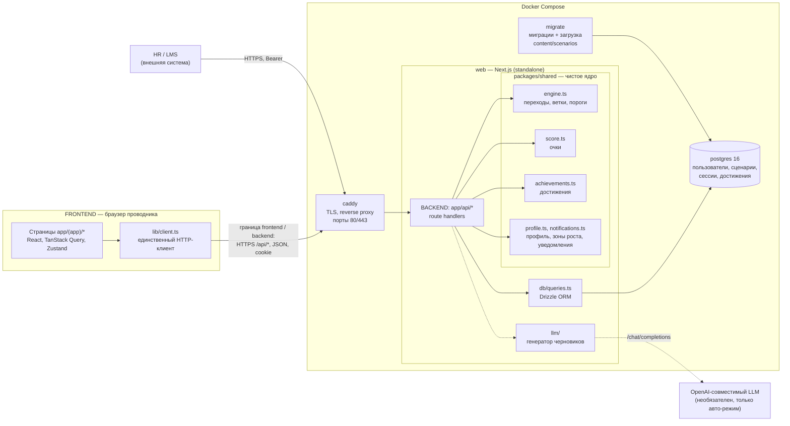
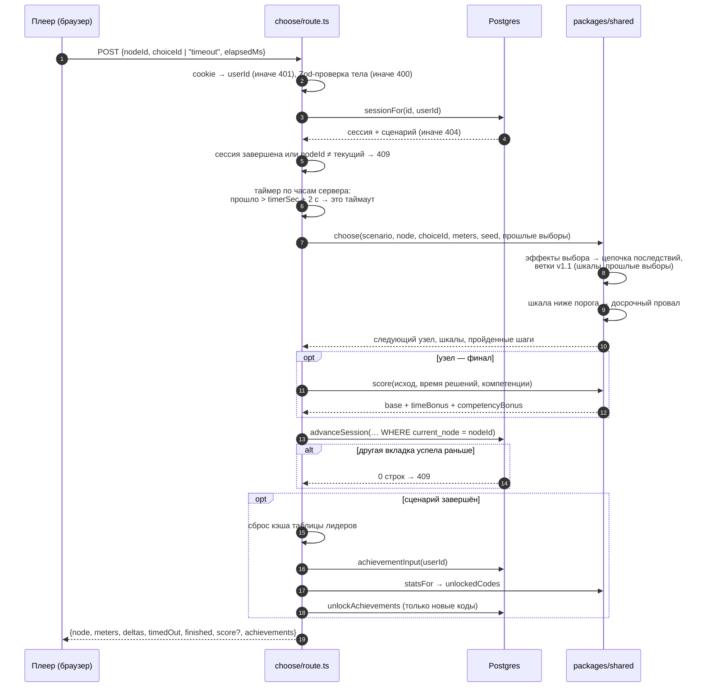

# Архитектура «Проводника 400»

Один TypeScript-монорепозиторий (pnpm workspaces), три части:

- **`packages/shared`** — чистое ядро без ввода-вывода: Zod-схема сценария и валидатор графа,
  игровой движок, подсчёт очков, правила достижений, профиль, уведомления. Покрыто тестами Vitest.
- **`apps/web`** — Next.js 15. Внутри две стороны с одной границей:
  - frontend — страницы `app/(app)/*` и компоненты. В базу не ходит, данные получает только через
    HTTP-клиент `lib/client.ts`;
  - backend — обработчики маршрутов `app/api/*`, слой запросов `db/queries.ts` (Drizzle ORM) и
    адаптер LLM `llm/`. Каждый маршрут проверяет вход (Zod), вызывает движок из `packages/shared`
    и возвращает JSON.
- **`content/scenarios/*.json`** — сценарии как данные. Новый сценарий — это файл, а не код:
  `pnpm validate:content` проверяет схему, достижимость узлов, отсутствие циклов и наличие
  компромисса «лояльность против безопасности».

Контракт между frontend и backend — REST API, описанный в
[`apps/web/public/openapi.yaml`](../apps/web/public/openapi.yaml) (на сервере — `/api-docs.html`).
Тест `apps/web/src/lib/openapi.test.ts` не даёт спецификации разойтись с кодом.

## Диаграмма компонентов

- Без LLM приложение работает целиком; модель нужна только для черновиков авто-режима и может
  работать внутри периметра заказчика (vLLM, Ollama).

## Граница frontend / backend и масштабирование

- **Frontend** — страницы `app/(app)/*` и `components/`. Страницы лишь передают параметры
  маршрута клиентским компонентам; данные те получают только по HTTP через `lib/client.ts`
  (`fetch('/api/…')`). Ни одна страница и ни один компонент не импортирует `db/`, `llm/` или
  серверный `lib/auth.ts`. Из `packages/shared` берут только типы ответов и константы
  (подписи компетенций, области рейтинга) — очки, шкалы и достижения в браузере не считаются.
- **Backend** — обработчики `app/api/*`: проверка входа (Zod), вызов ядра, запросы к Postgres
  через `db/queries.ts`. Внешние системы (HR, LMS) ходят в тот же backend по Bearer-токену.
- **Ядро** — `packages/shared`: движок, подсчёт очков, валидатор сценариев, достижения. Чистые
  функции без ввода-вывода; backend их вызывает, тесты проверяют без базы.
- **Масштабирование.** Веб-контейнер не хранит состояние: игровые сессии, профили и пул
  авто-режима — в Postgres, вход — подписанная cookie (ключ общий для всех экземпляров:
  `AUTH_SECRET` или том `secrets`). Поэтому контейнер `web` можно запустить в нескольких
  экземплярах за Caddy: пополнение пула авто-режима защищено advisory-lock в Postgres, запись шага
  — оптимистичная (`WHERE current_node = …`), двойной шаг получает 409.
- **Известные исключения** (см. «Ограничения» в README): счётчик попыток входа и 30-секундный кэш
  рейтинга живут в памяти процесса. При нескольких экземплярах лимит входа умножается на их число,
  а рейтинг может отставать до 30 с; лечится переносом обоих в Postgres или Redis.

## Последовательность: один шаг сценария

`POST /api/sessions/{id}/choose` — единственный маршрут, который двигает игру. Клиент присылает
узел, выбор (или `timeout`) и своё время; всё остальное решает сервер.

Почему так:

- **Сервер — судья по времени.** Клиентский таймер только рисует кольцо; опоздание больше
  чем на 2 с засчитывается как таймаут, что бы ни прислал клиент.
- **Движок — чистые функции.** Его можно тестировать и объяснить без базы и HTTP; маршрут лишь
  читает, вызывает и записывает.
- **Очки пересчитываются из сохранённого пути,** а не из запроса: клиент не может прислать
  себе результат.
- **Клиент не видит будущего.** `ClientNode` не содержит переходов, эффектов вариантов и
  разбора — их показывает только `GET /debrief` после финала.

## Масштабирование и потолки

| Что | Сейчас | Когда упрётся |
| --- | --- | --- |
| Счётчик попыток входа | в памяти процесса | при N контейнерах лимит становится 5·N в минуту → таблица в Postgres |
| Кэш таблицы лидеров | 30 с в памяти процесса | разные контейнеры покажут разный срез до 30 с → общий кэш |
| Пул авто-режима | advisory-lock в Postgres | безопасен при любом числе контейнеров |
| Сессии пользователей | подписанная cookie, без серверного хранилища | масштабируется без изменений |
